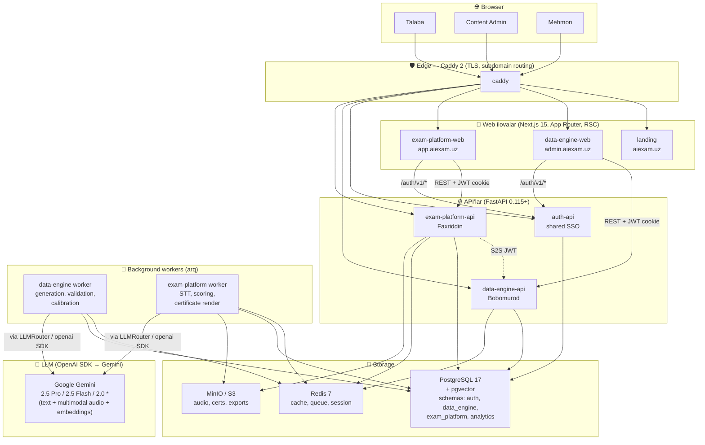
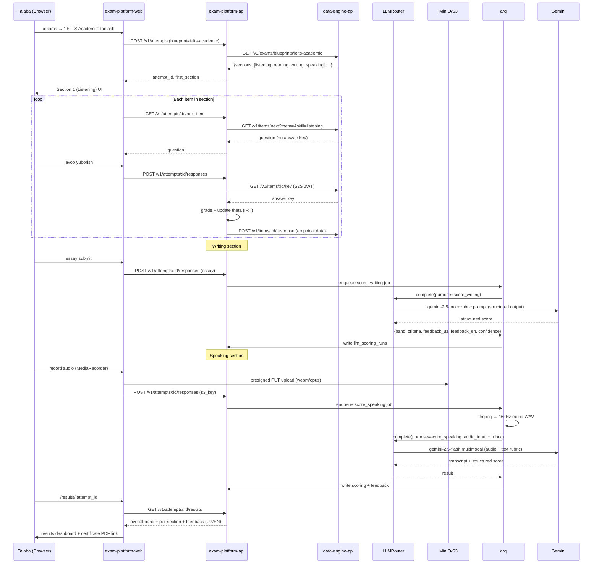
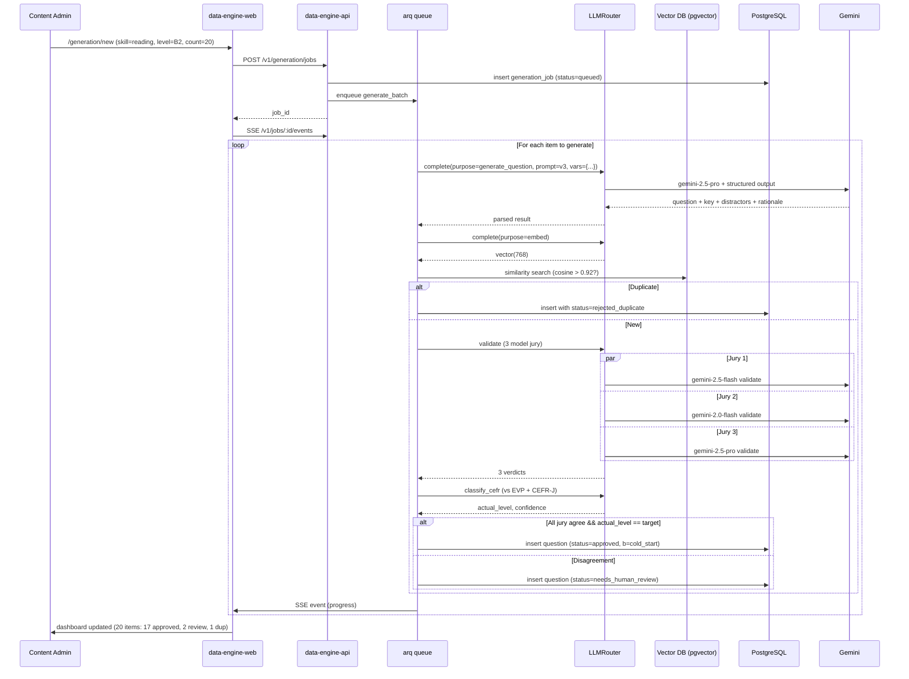

# LanguagePro AI — Tizim Arxitekturasi (System Overview)

> **Til**: O'zbek (asosiy) + English (diagrammalar va texnik atamalar)
> **Auditoriya**: Loyiha rivojlantiruvchilari, dissertatsiya komissiyasi, kelajakdagi yangi a'zolar.
> **Maqsad**: Yagona kirish nuqtasi — tizimni 15 daqiqada tushunish.

---

## 1. Loyiha haqida

**LanguagePro AI** — sun'iy intellekt arxitekturalari yordamida foydalanuvchining xorijiy (ingliz) tilini bilish darajasini onlayn aniqlaydigan platforma. **IELTS Academic** (Band 0–9) va **CEFR** (A1–C2) standartlariga muvofiq adaptiv test, avtomatik baholash va tushuntirib berilgan fikr-mulohaza taqdim etadi.

**Muhim**: Platforma rasmiy IELTS yoki Cambridge kontentini takrorlamaydi (litsenziya cheklovlari) — o'rniga ochiq ma'lumotlar (CEFR-J, English Vocabulary Profile, Speechocean762, Project Gutenberg) va AI tomonidan generatsiya qilingan, ekspertlar tomonidan validatsiya qilingan savollardan foydalanadi. Pozitsiya: **"IELTS-aligned, CEFR-calibrated"**.

### 1.1. Foydalanuvchi profillari

| Rol | Kim | Asosiy ehtiyoj |
|---|---|---|
| **Talaba (student)** | Ingliz tilini o'rganuvchi, IELTS yoki CEFR sertifikati kerak bo'lgan kishi | Tezkor, arzon, aniq baholash + amaliyot |
| **Mazmun-admin (content_admin)** | Bobomurodning admin panelidan foydalanuvchi: tilshunoslar, savol mualliflari | AI yordamida sifatli savollar generatsiya qilish va validatsiya |
| **Imtihonchi (examiner)** | Inson reviewer: past confidence bo'lgan LLM bahosini tekshiradi | Qulay review queue, izohlash imkoniyati |
| **Tadqiqotchi (researcher)** | BSU yoki tashqi tilshunoslar | Anonim ma'lumotlar eksporti, kalibratsiya hisobotlari |
| **Superadmin** | Loyiha mualliflari | Foydalanuvchilar, rollar, LLM provider sozlamalari |

---

## 2. Yuqori darajadagi arxitektura

### 2.1. Servislar topologiyasi

### 2.2. Subdomen xaritasi (production)

| URL | Servis | Egasi |
|---|---|---|
| `https://aiexam.uz` | landing | Joint |
| `https://app.aiexam.uz` | exam-platform-web | Faxriddin |
| `https://admin.aiexam.uz` | data-engine-web | Bobomurod |
| `https://api.aiexam.uz/auth/v1/*` | auth-api | Joint |
| `https://api.aiexam.uz/data/v1/*` | data-engine-api | Bobomurod |
| `https://api.aiexam.uz/exam/v1/*` | exam-platform-api | Faxriddin |

> Dev rejimida `*.localhost` ishlatiladi (Caddy lokal TLS). Browser'larda CORS muammosi bo'lmasligi uchun JWT cookie `Domain=.localhost`, prod'da `Domain=.aiexam.uz`.

---

## 3. Ma'lumot oqimi (Data Flow)

### 3.1. Talaba imtihon topshirayapti

### 3.2. Admin yangi savollar generatsiya qilayapti (Bobomurod)

### 3.3. Yopiq halqa: empirik ma'lumot IRT recalibration

Faxriddinning `analytics.item_response_data` jadvali har attempt'dan keyin to'ldiriladi → kechqurun `arq` tasklari Bobomurodning `data-engine`'ida `py-irt` orqali `b` va `a` parametrlarini qayta hisoblaydi → yangi parametrlar `item_parameters_history`'ga yoziladi va `questions.difficulty_b` yangilanadi.

Bu — **2 dissertatsiyani ilmiy jihatdan bog'laydigan** mexanizm: Faxriddinning platformasidagi haqiqiy foydalanuvchi javoblari Bobomurodning kalibratsiya algoritmiga "ovqat".

---

## 4. Texnologiyalar to'plami (Stack)

| Qatlam | Texnologiya | Versiya | Sabab |
|---|---|---|---|
| **Frontend framework** | Next.js | 15.x | App Router, RSC, Turbopack |
| **Til** | TypeScript | 5.6+ | strict mode |
| **Stillar** | Tailwind CSS | v4 | `@theme inline`, CSS variable theming |
| **UI primitives** | shadcn/ui | latest | copy-paste, no runtime dep |
| **Forms** | react-hook-form + zod | latest | type-safe validation |
| **Server state** | TanStack Query | v5 | admin tables; RSC + Server Actions birinchi navbat |
| **Client state** | Zustand | latest | exam runner state |
| **i18n** | next-intl | latest | locale segment, ICU |
| **Editor** | TipTap | latest | writing essay editor |
| **Audio** | MediaRecorder API + tus.io | — | resumable uploads |
| **Backend framework** | FastAPI | 0.115+ | async, OpenAPI, Pydantic v2 |
| **Python runtime** | CPython | 3.12+ | TaskGroup, PEP 695 generics |
| **ORM** | SQLAlchemy | 2.0 | async, type-safe |
| **Migrations** | Alembic | latest | per-service env |
| **Background jobs** | arq | latest | async, Redis-based |
| **Validation** | Pydantic | v2 | shared with FastAPI |
| **DB** | PostgreSQL | 17 | pgvector ext |
| **Cache/Queue/Session** | Redis | 7 | DB 0 default, 1 LLM cache, 2 queue |
| **Object storage** | MinIO (dev) / S3 (prod) | latest | presigned URLs |
| **LLM client** | `openai` SDK (Python + JS) | latest | Single SDK, points at Gemini's OpenAI-compat endpoint |
| **LLM models** | Google Gemini 2.5 Pro / 2.5 Flash / 2.0 Pro / 2.0 Flash | latest | **No ChatGPT** — Gemini only via `OPENAI_BASE_URL` override |
| **Embeddings** | Gemini `gemini-embedding-001` | — | Same SDK, dimension 768 (pgvector compatible) |
| **STT** | Gemini 2.5 Flash multimodal (audio input) | — | No separate Whisper — single provider |
| **IRT** | py-irt (Pyro), custom selector | latest | 2PL model |
| **Reverse proxy** | Caddy | 2 | auto TLS, simple Caddyfile |
| **Containers** | Docker + Compose v2 | latest | dev parity with prod |
| **Observability** | Sentry + structlog + Langfuse | latest | LLM-specific tracing |
| **Test (BE)** | pytest + pytest-asyncio + testcontainers | latest | real Postgres in tests |
| **Test (FE)** | Vitest + Playwright | latest | unit + E2E |
| **Test (load)** | k6 | latest | 50 concurrent attempts target |
| **Lint/Format Python** | ruff + mypy strict | latest | one tool replaces black/isort/flake8 |
| **Lint/Format TS** | ESLint flat config + Biome | latest | Biome faster than Prettier |
| **Pre-commit** | lefthook | latest | YAML, polyglot |
| **JS workspace** | pnpm + Turborepo | latest | strict, fast cache |
| **Python workspace** | uv | 0.5+ | 10–100× faster than pip |

---

## 5. Ma'lumotlar bazasi sxemasi (yuqori daraja)

| Schema | Egasi | Asosiy jadvallar |
|---|---|---|
| `auth` | Joint (auth-api) | `users`, `roles`, `user_roles`, `sessions`, `oauth_accounts`, `api_keys` |
| `data_engine` | Bobomurod | `question_banks`, `questions` (+`question_versions`, `question_embeddings`), `generation_jobs/runs`, `validation_results`, `human_reviews`, `taxonomies` (cefr_levels, ielts_sections, skills, can_do_statements), `rubrics`, `exam_blueprints`, `prompt_templates/versions`, `runtime_config`, `calibration_runs`, `item_parameters_history` |
| `exam_platform` | Faxriddin | `exams`, `exam_attempts`, `attempt_sections`, `attempt_responses`, `audio_recordings`, `transcripts`, `llm_scoring_runs`, `scoring_results`, `human_review_queue`, `feedback`, `certificates` |
| `analytics` | Joint | `events`, `llm_calls` (cost log), `item_response_data` (IRT loop) |

To'liq DDL: tegishli `apps/*/docs/03-data-model.md`.

---

## 6. Auth & Security (qisqa)

- **JWT cookie SSO**: `auth-api` HS256 JWT'larni `__Host-` cookie sifatida `.aiexam.uz` apex domenda chiqaradi. Refresh tokenlar Redis'da saqlanadi (revocation imkoniyati).
- **RBAC**: 5 rol — `student`, `examiner`, `content_admin`, `researcher`, `superadmin`. Endpoint dekoratorlari: `@require_role("content_admin")`.
- **S2S**: `exam-platform-api` → `data-engine-api` chaqiruvlarida 5-min TTL'li signed JWT (`iss=exam-platform`, `aud=data-engine`).
- **Rate limit**: `fastapi-limiter` + Redis. Per-IP va per-user limitlar.
- **Audio yuklash**: faqat presigned PUT URL orqali — server orqali oqim emas.

To'liq: [`security.md`](security.md).

---

## 7. Kuzatuv (Observability)

| Asbob | Maqsad | Phase |
|---|---|---|
| `structlog` JSON logs | Strukturalashgan stdout logs | 1 |
| Sentry (BE+FE) | Xato kuzatuvi | 1 |
| FastAPI `/healthz`, `/readyz` | K8s probes, monitoring | 1 |
| OpenTelemetry → SigNoz | Distributed tracing | 2 (optional) |
| Langfuse self-hosted | LLM-specific: prompt versions, token cost, latency, output sample | 2 (Bobomurod tezisi uchun zarur) |
| Prometheus + Grafana | Metrics dashboards | 2 |
| k6 ci-test | Load test target: 50 concurrent attempts, p95 < 500ms nav | 8-haftada |

---

## 8. Phased Delivery (12 hafta)

| Hafta | Bobomurod | Faxriddin | Joint |
|---|---|---|---|
| **1** | uv workspace, FastAPI skeleton, **DOCS** | Next.js skeleton, **DOCS** | Monorepo, Docker compose, Caddy, auth-api MVP, CI |
| **2** | Taxonomy seed, savol CRUD, admin shell | exam-platform skeleton, attempt CRUD | LLMRouter v1 + PromptRegistry |
| **3** | Question generation E2E (MCQ reading) | MCQ exam runner E2E (no adaptive) | S2S auth, contract tests |
| **4** | Multi-jury validation, dedup, review queue | Listening + Reading runner, results | First E2E demo |
| **5** | All 4 skills generation | Writing editor + LLM scoring (async) | Langfuse self-hosted |
| **6** | CEFR classifier, cold-start `b`, IRT params | MediaRecorder + Whisper + speaking | Mid-project review |
| **7** | py-irt nightly, `/v1/items/next` | Adaptive item selection wired | i18n full pass |
| **8** | Calibration dashboard, prompt UI | Feedback render, certificate PDF | k6 load test |
| **9** | Researcher CSV export | UX polish, WCAG AA | Production VPS deploy |
| **10** | Tezis: pipeline + IRT bo'limlari | Tezis: platforma + scoring | Pilot 10–20 BSU students |
| **11** | Recalibration, comparison tables | IRR study (LLM vs human, n=30) | Defense slides |
| **12** | Buffer / Phase 2 LiveKit | Buffer / Phase 2 LiveKit | Final defense rehearsal |

---

## 9. Tavakkalliklar (qisqa)

| # | Risk | Mitigation |
|---|---|---|
| 1 | Muddat surilishi | 2-haftada kontraktlarni muzlatish, mocks |
| 2 | LLM scoring sifati | 11-haftada IRR study, target Pearson r > 0.75 |
| 3 | Audio infra | webm/opus, ffmpeg normalize, tus.io for >5min |
| 4 | IELTS litsenziya | Cambridge kontentini takrorlamaslik. Batafsil: [`data-licensing.md`](data-licensing.md) |
| 5 | 2 tezis bitta loyihaday ko'rinishi | Per-project `09-thesis-mapping.md`, alohida demos |

---

## 10. Keyingi qadamlar

1. Phase 0 (joriy bosqich): hujjatlarni tugatish va foydalanuvchi tomonidan tasdiqlash.
2. Phase 1 (1-hafta oxiri): monorepo skeleton ishga tushadi (Docker compose up bilan), `auth-api` MVP, ikkita FastAPI servis "hello world".
3. Phase 2 (2–4 haftalar): Question generation va exam runner E2E.

---

_Last reviewed: 2026-04-26 by joint authors_
